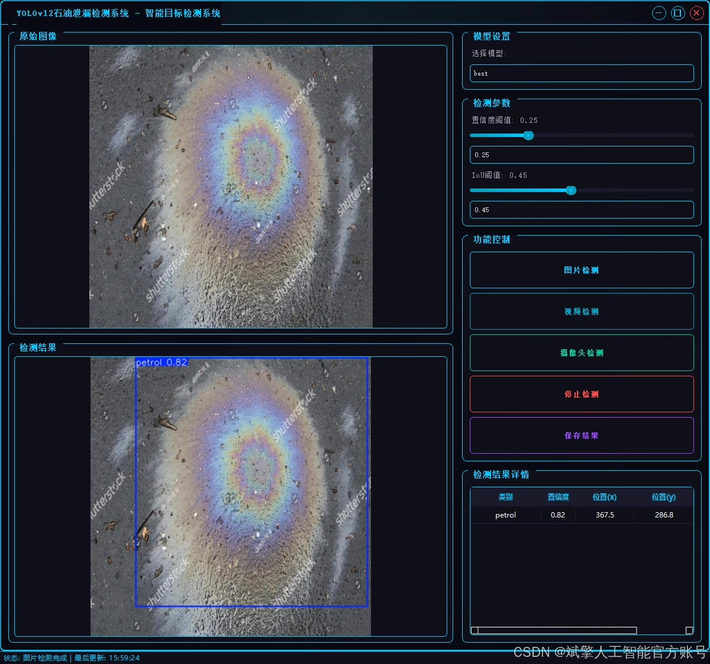
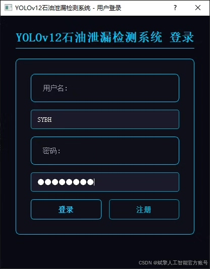
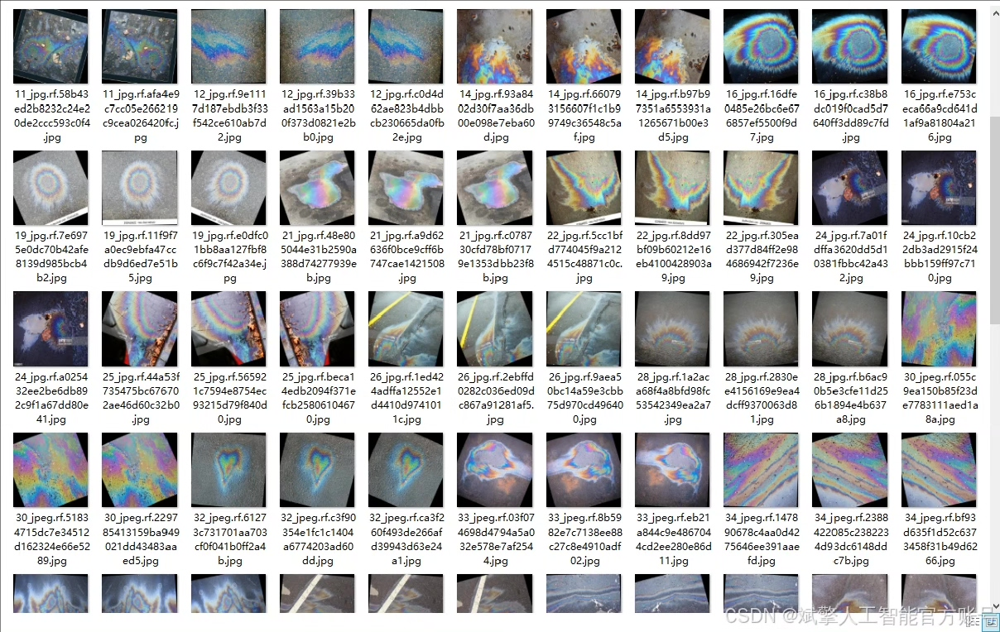
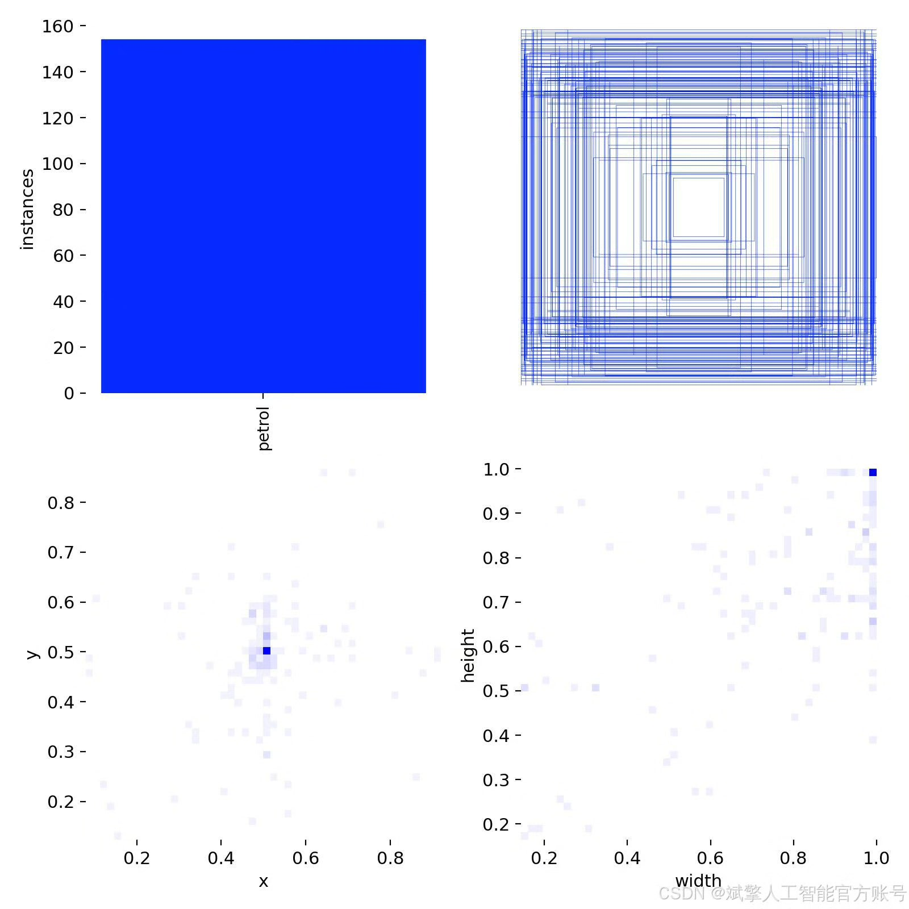
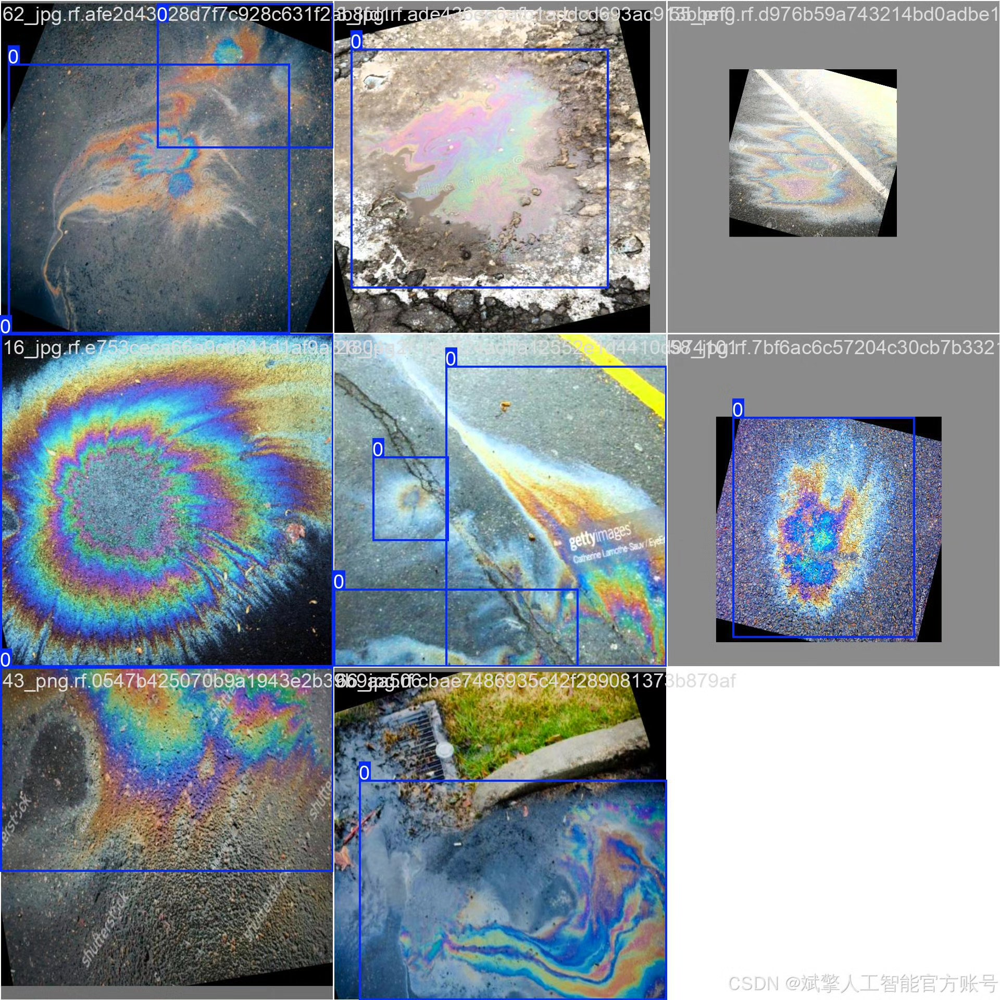
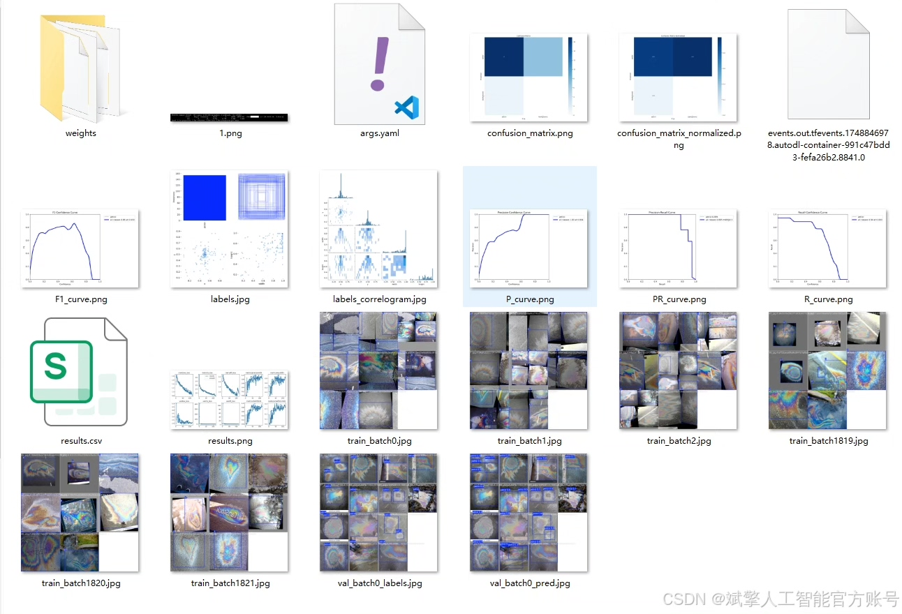
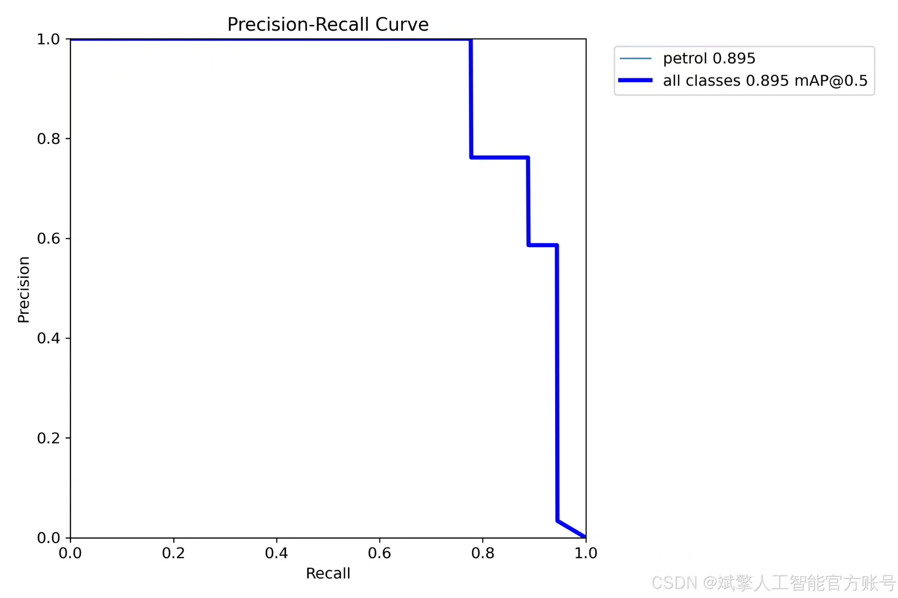
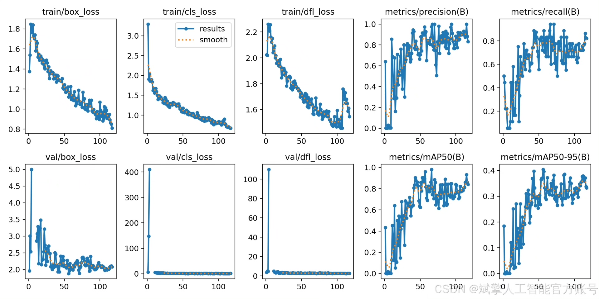
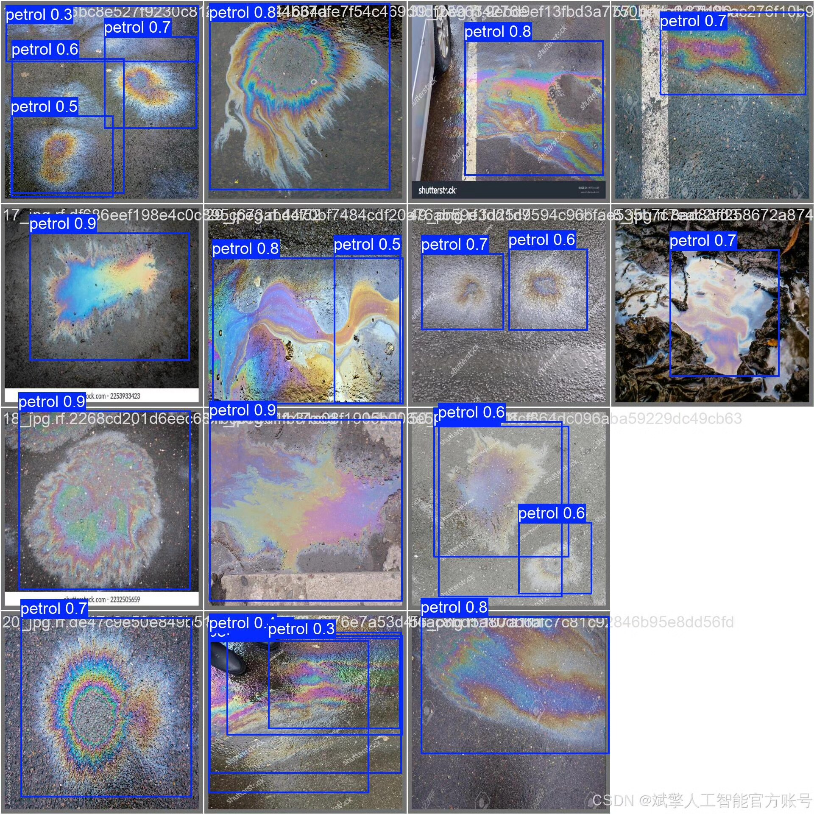

# YOLOv12 Oil Spill Detection System

## Body

YOLOv12 Oil Spill Detection System Based on Deep Learning YOLOv12: A Detection System for Oil Spills (YOLOv12+YOLO dataset + UI interface + login and registration interface + Python project source code + model)

Dataset:
nc: 1 class,
name: ['petrol'],
dataset quantity: training set 130 images, validation set 24 images.

✅ User Login and Registration: Support password detection and security verification.
✅ Three detection modes: based on the YOLOv12 model, support image, video, and real-time camera three detection, accurately identify the target.
✅ Dual-screen comparison: display the original image and detection results on the same screen.
✅ Data visualization: real-time table displaying the category, confidence, and coordinates of detected targets.
✅ Intelligent parameter adjustment: provide a confidence slide bar to dynamically optimize detection accuracy, adapt to different scene requirements.
✅ Sci-fi style interactive interface: dark theme combined with dynamic light effects, reduce visual fatigue, improve operational experience.

## Images

## Payment

Here is a pay link on Stripe ( https://buy.stripe.com/3cs8yP7sY87d0vu9AB ). Please contact me lonlonago@foxmail.com after funding $89, and I will send you a complete data files , thank you!

